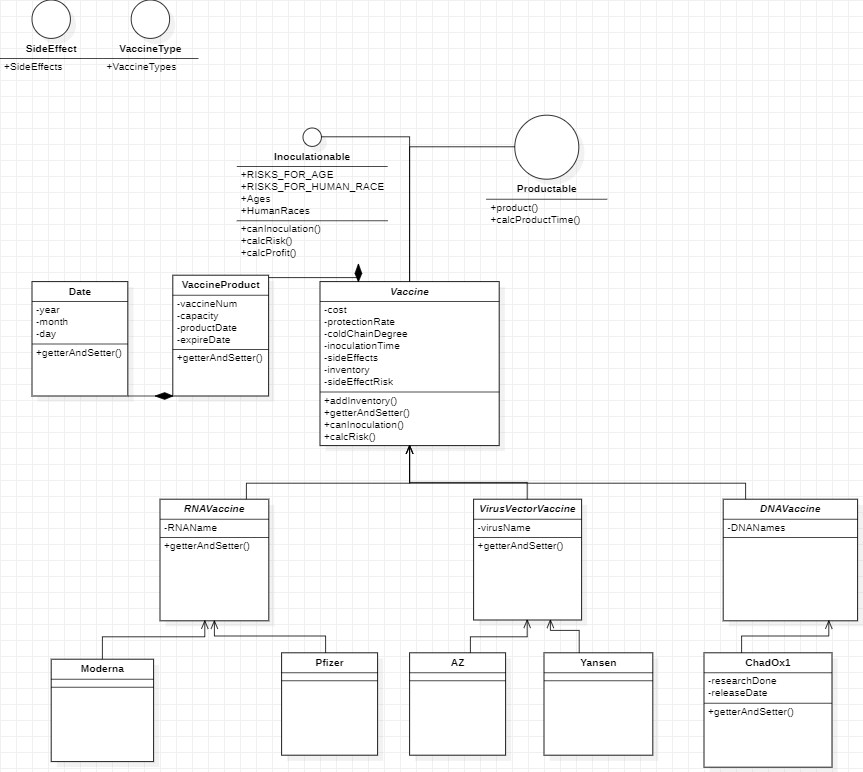

# Team 1 ReadMe File

## Summary
[toGithub] https://github.com/kanei0415/VaccineCMSJavaSwing

### Description
* Login Form : 정부 사람이 맞는지 확인 (보안)
* Country : 정부의 자국 코로나 백신현황 보기 및 백신 접종, 구매 현황 표시, 자국 회사들 정보 보기 가능
  * 회사 전체 보기 및 관리 누르면 Company Frame 띄우기
* Company : 회사가 백신을 생산 및 모든 회사 정보 관리, 각각의 회사 정보도 관리
* Vaccine : 이름, 부작용 등의 정보 및 VaccineProduct[] 을 이용한 백신의 data를 저장 및 관리

### Structure
* Login
* Country(Company Show, Vaccine) -> Company(name, Vaccine)

## 2020110761 김영호
> GUI   
* landing
  * CompanyLogin.java
  * CountryLogin.java
  * LandingPage.java
  * LoginHome.java
  * SignIn.java

* vaccineView
  * EffectivenessContents.java
  * InformationContents.java
  * InventoryContents.java
  * MainContents.java
  * TopBar.java
  * VaccineMainMenu.java

## 2020115974 한강민 
> GUI
* CountryManage (GUI 구현)
  * CountryScreen.java
  * LocalStockScreen.java
  * LocalVaccineControl.java
  * NationalStockScreen.java
  * NationalVaccineControl.java
* CountryInit (내부 클래스 구현 - 일부 구현 완료)
  * Country.java
  * LocalGov.java
  * CAUTION: This can be changed by the plan or program of other members.
  * Company, Vaccine Class를 import하여 프로그램 작성 및 테스트 예정

> MODEL   

* vaccine
  * AZ.java
  * ChadOx1.java
  * Date.java
  * AZ.java
  * AZ.java
  * AZ.java
  * AZ.java
  * AZ.java
  * AZ.java
  * AZ.java
  * AZ.java
  * AZ.java
  * AZ.java
  * AZ.java
  * AZ.java
